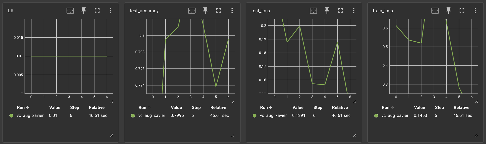

# ECE 18661 Bonus Questions

- [ECE 18661 Bonus Questions](#ece-18661-bonus-questions)
  - [Question 1: Decision Tree for Spotify Data](#question-1-decision-tree-for-spotify-data)
    - [1.1 Import Data](#11-import-data)
      - [Import the data into a Pandas dataframe](#import-the-data-into-a-pandas-dataframe)
      - [Of the remaining features which you believe may be useful for classification, which feature(s) do you estimate will be the most important? Which feature(s) will be the least important?](#of-the-remaining-features-which-you-believe-may-be-useful-for-classification-which-features-do-you-estimate-will-be-the-most-important-which-features-will-be-the-least-important)
  - [Question 2: Learning to classify the “classy” digits](#question-2-learning-to-classify-the-classy-digits)
    - [(a) Explain the purpose of the __len__ and __getitem__ methods in the dataloader class. Write-up](#a-explain-the-purpose-of-the-len-and-getitem-methods-in-the-dataloader-class-write-up)
    - [(b) In the cell containing the class FMNIST(Dataset) complete the methods provided, ensuring that the images are scaled to `[0,1]`. Please ensure that you use the hyperparameters from the cfg dictionary](#b-in-the-cell-containing-the-class-fmnistdataset-complete-the-methods-provided-ensuring-that-the-images-are-scaled-to-01-please-ensure-that-you-use-the-hyperparameters-from-the-cfg-dictionary)
    - [2.1.3 Designing the architecture](#213-designing-the-architecture)
      - [2.1.3.a Define the architecture in the class Network](#213a-define-the-architecture-in-the-class-network)
      - [2.1.3.b Write code for saving and loading the model in the load and save methods of Network, which can be used to stop the training in an intermediate epoch and load it later to resume training](#213b-write-code-for-saving-and-loading-the-model-in-the-load-and-save-methods-of-network-which-can-be-used-to-stop-the-training-in-an-intermediate-epoch-and-load-it-later-to-resume-training)
    - [2.1.4 A holistic view of the training](#214-a-holistic-view-of-the-training)
      - [Training Loss](#training-loss)
      - [Test Accuracy](#test-accuracy)
      - [Current learning rate](#current-learning-rate)
    - [2.1.5 Training the model](#215-training-the-model)
      - [Learning Rate Scheduling - Use the ReduceLROnPlateau scheduler to anneal the learning rate based on the test set accuracy](#learning-rate-scheduling---use-the-reducelronplateau-scheduler-to-anneal-the-learning-rate-based-on-the-test-set-accuracy)
      - [(f) Finally, train the model using the hyper-parameters in the cfg dictionary](#f-finally-train-the-model-using-the-hyper-parameters-in-the-cfg-dictionary)
    - [2.2 Improving our Vanilla Classifier](#22-improving-our-vanilla-classifier)
      - [(a) Initialize the weights of your Multi-Layered Perceptron in the init\_weights function using the fol- lowing strategies](#a-initialize-the-weights-of-your-multi-layered-perceptron-in-the-init_weights-function-using-the-fol--lowing-strategies)
      - [(b) Data Augmentation has been a very useful technique for effective training of Deep Learning models. Give two examples of how data augmentation can be useful (In any task of your choice). Write-up](#b-data-augmentation-has-been-a-very-useful-technique-for-effective-training-of-deep-learning-models-give-two-examples-of-how-data-augmentation-can-be-useful-in-any-task-of-your-choice-write-up)
      - [(h) 2.2 (c) Tensorboard screenshot, final train loss and final test accuracy of VC + XNW + Data Augmentation (DA)](#h-22-c-tensorboard-screenshot-final-train-loss-and-final-test-accuracy-of-vc--xnw--data-augmentation-da)

## Question 1: Decision Tree for Spotify Data

### 1.1 Import Data

#### Import the data into a Pandas dataframe

Pandas is a data analysis library that is very useful for machine learning projects. Examine the data. Which features, if any, appear to not be useful for classification and should be removed? Print the final list of the feature names that you believe to be
useful.

```python
def load_data():
    """ Load Data Set, making sure to import the index column correctly
        Arguments:
            None
        Returns:
            Training data dataframe, training labels, testing data dataframe,
            testing labels, features list
    """
    df = pd.read_csv('spotify_data.csv', index_col=0, header=0)
    df = df.drop(['song_title', 'artist'], axis=1)
    df_without_target = df.drop(['target'], axis=1)
    labels = df['target']
    corr_w_target = df.corr()['target'].sort_values(ascending=False)
    print("="*80)
    print("Feature Correlation with Target")
    print(corr_w_target)
    
    plt.bar(corr_w_target.index, corr_w_target)
    plt.xticks(rotation=45)
    plt.title('Correlation with Target')
    plt.ylabel('Correlation')
    plt.xlabel('Features')
    plt.tight_layout()
    plt.savefig('corr_w_target.png')
    plt.clf()

    X_train, X_test, y_train, y_test = train_test_split(df_without_target, labels, test_size=0.2)
    return X_train, X_test, y_train, y_test, df_without_target.columns.values.tolist()
```

Prints out the following result:

```text
Dataframe Feature Names
['acousticness', 'danceability', 'duration_ms', 'energy', 'instrumentalness', 'key', 'liveness', 'loudness', 'mode', 'speechiness', 'tempo', 'time_signature', 'valence', 'target', 'song_title', 'artist']
```

The columns that are clearly not useful for classification are:

1. song_title
2. artist

This is because the combination of song title and artist name are unique for each song, so they do not provide any useful information for classification.

Thus, we drop them from the dataframe and print out the final list of feature names that I believe to be useful

```text
Dropped Dataframe Feature Names
['acousticness', 'danceability', 'duration_ms', 'energy', 'instrumentalness', 'key', 'liveness', 'loudness', 'mode', 'speechiness', 'tempo', 'time_signature', 'valence', 'target']
```

#### Of the remaining features which you believe may be useful for classification, which feature(s) do you estimate will be the most important? Which feature(s) will be the least important?

Briefly explain your answers.

## Question 2: Learning to classify the “classy” digits

### (a) Explain the purpose of the __len__ and __getitem__ methods in the dataloader class. Write-up

The purpose of the __len__ method is to return the length of the dataset. The purpose of the __getitem__ method is to return the item at the given index. The __getitem__ method is used to support the indexing such as dataset[i] and dataset[i:j].

### (b) In the cell containing the class FMNIST(Dataset) complete the methods provided, ensuring that the images are scaled to `[0,1]`. Please ensure that you use the hyperparameters from the cfg dictionary

**Note: I removed the `cfg.num_worker` parameter from the dataloader because I encountered an error on my M2 laptop.**

See this <https://github.com/Lightning-AI/pytorch-lightning/discussions/15350#discussioncomment-6576784> for more details.

```python
class FMNIST(Dataset):
    def __init__(self, set_name, data_augmentation=True):
        super(FMNIST, self).__init__()
        # TODO: Retrieve all the images and the labels, and store them
        # as class variables. Maintaing any other class variables that
        # you might need for the other class methods. Note that the
        # methods depends on the set (train or test) and thus maintaining
        # that is essential. Consider data_augmentation=True and False cases

        DATA_PATH = "fashion-mnist"
        set_name = set_name.lower()
        if set_name not in ['train', 'test']:
            raise ValueError("set_name must be 'train' or 'test'")

        else:
            if set_name == 'train':
                self.labels_file = "train_labels.npy"
                self.images_file = "train_images.npy"
            elif set_name == 'test':
                self.labels_file = "test_labels.npy"
                self.images_file = "test_images.npy"

            images_path = self.images_file
            labels_path = self.labels_file

            self.images = np.load(images_path)
            self.labels = np.load(labels_path)
            self.images = normalize_data(self.images)

            if data_augmentation is True and set_name=='train':
                self.transform = transforms.Compose([
                    transforms.ToPILImage(),
                    transforms.RandomHorizontalFlip(),
                    transforms.ToTensor()
                ])
            else:
                self.transform = transforms.ToTensor()

    def __len__(self):
        return len(self.images)

    def __getitem__(self, index):
        return self.images[index], self.labels[index]

def normalize_data(input_data):
    n = input_data.shape[0]
    r = input_data.shape[1]
    c = input_data.shape[2]
    input_data = input_data.reshape(n, r*c)
    normalized_input_data = (input_data - input_data.min(axis=1, keepdims=True)) / (input_data.max(axis=1, keepdims=True) - input_data.min(axis=1, keepdims=True))
    normalized_input_data = normalized_input_data.reshape((n, r, c))
    return normalized_input_data

def get_data_loader(set_name, data_augmentation=False):
    # TODO: Create the dataset class tailored to the set (train or test)
    # provided as argument. Use it to create a dataloader. Use the appropriate
    # hyper-parameters from cfg
    data_augmentation = True if set_name == 'train' else False
    dataset = FMNIST(set_name, data_augmentation)
    data_loader = DataLoader(
        dataset,
        batch_size=cfg.get('batch_size'),
        shuffle=True if set_name == 'train' else False
    )
    return data_loader
```

### 2.1.3 Designing the architecture

#### 2.1.3.a Define the architecture in the class Network

We will use an architecture containing one hidden layers (784 → 100 → 10) with a ReLU activation after the first layer and a Softmax after the final logits to get probability scores. Note that the input images are sized 28 × 28 and thus the input is obtained by flattening the images, making it sized 784. The architecture has been visually delineated in Figure 4. Note that we will be using the PyTorch cross entropy loss criterion which applies Softmax on the output logits before computing the cross-entropy loss and therefore you do not need to explicitly apply Softmax in this case

#### 2.1.3.b Write code for saving and loading the model in the load and save methods of Network, which can be used to stop the training in an intermediate epoch and load it later to resume training

For both of these questions, see the code below.

```python
class Network(nn.Module):
    def __init__(self, dropout_strategy=False, weight_init_strategy='vanilla'):
        super(Network, self).__init__()
        # TODO: Define the model architecture here
        # Define proportion or neurons to dropout
        self.flatten = nn.Flatten()
        if dropout_strategy:
            #TODO
            self.linear_relu_stack = nn.Sequential(
                nn.Linear(784, 100),
                nn.ReLU(),
                nn.Dropout(0.5),
                nn.Linear(100, 10),
            )
        else:
            #TODO
            self.linear_relu_stack = nn.Sequential(
                nn.Linear(784, 100),
                nn.ReLU(),
                nn.Linear(100, 10),
            )
        self.double()

        # initialize weights
        self.init_weights(weight_init_strategy)

        # Dummy initialization of optimizer variable useful to load the optimizer
        # It is truly initialized before saving in train.py's train function
        self.optimizer = optim.SGD(self.parameters(), lr=0)


    def init_weights(self, init_weights_strategy=None):
        # NOTE: Not for Vanilla Classsifier
        # TODO: Initalize weights by calling by using the
        # appropriate initialization function
        self.init_weights_strategy = init_weights_strategy
        if (init_weights_strategy is None) or (init_weights_strategy == "vanilla") :
            #TODO (Hint: This is Vanilla Classifier Default)
            pass
        elif init_weights_strategy == "zero":
            for param in self.parameters():
                nn.init.zeros_(param)
        elif init_weights_strategy == "xavier":
            for param in self.parameters():
                if isinstance(param, nn.Linear):
                    nn.init.xavier_uniform_(param)
        else:
            print("No '{}' initialization strategy available ".format(init_weights_strategy))
            print("Available Strategies: \n'xavier'\n'zero'")
            raise NotImplementedError

    def forward(self, x):
        # TODO: Define the forward function of your model
        x = self.flatten(x)
        logits = self.linear_relu_stack(x)
        return logits

    def save(self, ckpt_path):
        # TODO: Save the checkpoint of the model
        checkpoint = {
            'model_state_dict': self.state_dict(),
            'optimizer_state_dict': self.optimizer.state_dict()
        }
    # Save the dictionary to the file
        torch.save(checkpoint, ckpt_path)

    def load(self, ckpt_path):
        # TODO: Load the checkpoint of the model
        checkpoint = torch.load(ckpt_path)

         # Load the model state
        self.load_state_dict(checkpoint['model_state_dict'])

        # Load the optimizer state
        self.optimizer.load_state_dict(checkpoint['optimizer_state_dict'])

```

### 2.1.4 A holistic view of the training

#### Training Loss


#### Test Accuracy


#### Current learning rate


### 2.1.5 Training the model

See the code below for question a-e.

```python
SEED = 42
np.random.seed(SEED)
torch.manual_seed(SEED)

def log_print(text, color=None, on_color=None, attrs=None):
    if cprint is not None:
        cprint(text, color=color, on_color=on_color, attrs=attrs)
    else:
        print(text)

def get_lr(optimizer):
    #TODO: Returns the current Learning Rate being used by
    # the optimizer
    for param_group in optimizer.param_groups:
        return param_group['lr']

'''
Use the average meter to keep track of average of the loss or
the test accuracy! Just call the update function, providing the
quantities being added, and the counts being added
'''
class AvgMeter():
    def __init__(self):
        self.qty = 0
        self.cnt = 0

    def update(self, increment, count):
        self.qty += increment
        self.cnt += count

    def get_avg(self):
        if self.cnt == 0:
            return 0
        else:
            return self.qty/self.cnt


def run(net, epoch, loader, optimizer, criterion, logger, scheduler, train=True):
    # TODO: Initalize the different Avg Meters for tracking loss and accuracy (if test)
    avg_loss = AvgMeter()
    if train is False:
        avg_accuracy = AvgMeter()

    # TODO: Performs a pass over data in the provided loader
    # TODO: Iterate over the loader and find the loss. Calculate the loss and based on which
    # set is being provided update you model. Also keep track of the accuracy if we are running
    # on the test set.
    for batch, (X, y) in tqdm(enumerate(loader)):
        # send to GPU
        net.to(device)
        X, y = X.to(device), y.to(device)
        # Compute prediction and loss
        optimizer.zero_grad()
        logit = net(X)
        loss = criterion(logit, y)
        avg_loss.update(loss, len(y))
        if train is True:
            # Backpropagation
            loss.backward()
            optimizer.step()
        else:
            pred_label = torch.argmax(logit, dim=1)
            accuracy_sum = (pred_label.cpu().T == y.cpu()).sum()
            avg_accuracy.update(accuracy_sum, len(y))

    # TODO: Log the training/testing loss using tensorboard.
    if train is True:
        logger.add_scalar('train_loss', loss, epoch)
    else:
        logger.add_scalar('test_loss', loss, epoch)

    # TODO: return the average loss, and the accuracy (if test set)
    if train is True:
        return avg_loss.get_avg(), None 
    else:
        return avg_loss.get_avg(), avg_accuracy.get_avg()


def train(net, train_loader, test_loader, logger):
    # TODO: Define the SGD optimizer here. Use hyper-parameters from cfg
    optimizer = torch.optim.SGD(
        net.parameters(),
        lr=cfg.get('lr'),
        weight_decay=cfg.get('weight_decay'),
        momentum=cfg.get('momentum'),
        nesterov=cfg.get('nesterov'),
    )
    net.optimizer = optimizer
    # TODO: Define the criterion (Objective Function) that you will be using
    criterion = nn.CrossEntropyLoss()
    # TODO: Define the ReduceLROnPlateau scheduler for annealing the learning rate
    scheduler = scheduler = torch.optim.lr_scheduler.ReduceLROnPlateau(
        optimizer,
        factor=cfg.get('lr_decay'),
        patience=cfg.get('patience'),
    )

    for i in range(cfg['epochs']):
        # Run the network on the entire train dataset. Return the average train loss
        # Note that we don't have to calculate the accuracy on the train set.
        loss, _ = run(net, i, train_loader, optimizer, criterion, logger, scheduler)

        # TODO: Get the current learning rate by calling get_lr() and log it to tensorboard
        current_learning_rate = get_lr(optimizer)
        logger.add_scalar('LR', current_learning_rate, i)

        # Logs the training loss on the screen, while training
        if i % cfg['log_every'] == 0:
            log_text = "Epoch: [%d/%d], Training Loss:%2f" % (i, cfg['epochs'], loss)
            log_print(log_text, color='green', attrs=['bold'])

        # Evaluate our model and add visualizations on tensorboard
        if i % cfg['val_every'] == 0:
            # TODO: HINT - you might need to perform some step before and after running the network
            # on the test set
            # Run the network on the test set, and get the loss and accuracy on the test set
            with torch.no_grad():
                loss, acc = run(net, i, test_loader, optimizer, criterion, logger, scheduler, train=False)

            # TODO: Perform a step on the scheduler, while using the Accuracy on the test set
            scheduler.step(metrics=acc)

            # TODO: Use tensorboard to log the Test Accuracy and also to perform visualization of the
            logger.add_scalar('test_accuracy', acc, i)
            # 2 weights of the first layer of the network!
            img = net.linear_relu_stack[0].weight[0].reshape(28, 28)
            img = np.reshape(img.cpu().detach().numpy(), (28, 28))
            logger.add_image('Image of weights connecting all the input nodes to first node of the first hidden layer for epoch {}: '.format(i), img,dataformats='HW')

            img = net.linear_relu_stack[0].weight[1].reshape(28, 28)
            img = np.reshape(img.cpu().detach().numpy(), (28, 28))
            logger.add_image('Image of weights connecting all the input nodes to second node of the first hidden layer for epoch {}: '.format(i), img, dataformats='HW')

```

#### Learning Rate Scheduling - Use the ReduceLROnPlateau scheduler to anneal the learning rate based on the test set accuracy

Read about the patience and factor parameters of this scheduler, and explain their role. Use the hyper-parameters from the cfg dictionary.

Ans: The patience parameter is the number of epochs with no improvement after which learning rate will be reduced. For example, if patience = 2, then we will ignore the first 2 epochs with no improvement, and will only decrease the LR after the 3rd epoch if the loss still hasn’t improved then. The factor parameter is the factor by which the learning rate will be reduced. For example, factor = 0.1, then the `new_LR = old_LR * 0.1`.

**Code: see above**

#### (f) Finally, train the model using the hyper-parameters in the cfg dictionary

As a milestone, you should be able to achieve around 75% accuracy on the test set, within the 20 epochs. Include the tensorboard screenshots in the writeup and report the final train loss and test accuracy Code Write-up.

The final train loss is `0.3224` and the final test accuracy is `0.7625`.


### 2.2 Improving our Vanilla Classifier

#### (a) Initialize the weights of your Multi-Layered Perceptron in the init_weights function using the fol- lowing strategies

1. All weights and biases zeros
2. Using Xavier Normal initialization for the weights and zeros for the biases
At the end, report performance on the test set using the two initialization strategies and explain the difference in performance, if any.

The following is my code for the two initialization strategies called in the `Network` class.

```python
def init_weights(self, init_weights_strategy=None):
    # NOTE: Not for Vanilla Classsifier
    # TODO: Initalize weights by calling by using the
    # appropriate initialization function
    self.init_weights_strategy = init_weights_strategy
    if (init_weights_strategy is None) or (init_weights_strategy == "vanilla") :
        #TODO (Hint: This is Vanilla Classifier Default)
        pass
    elif init_weights_strategy == "zero":
        for param in self.parameters():
            nn.init.zeros_(param)
    elif init_weights_strategy == "xavier":
        for param in self.parameters():
            if isinstance(param, nn.Linear):
                nn.init.xavier_uniform_(param)
    else:
        print("No '{}' initialization strategy available ".format(init_weights_strategy))
        print("Available Strategies: \n'xavier'\n'zero'")
        raise NotImplementedError
```

report performance on the test set using the two initialization strategies and explain the difference in performance, if any.

Results using zero initialization:


The final train loss is `2.2969` and the final test accuracy is `0.1`.

This makes sense because the weights are all initialized to zero, so the model is not learning at all.

Results using Xavier Normal initialization:


The final train loss is `0.6118` and the final test accuracy is `0.7565`.

Compared to the zero initialization, the Xavier Normal initialization performs much better. Xavier Normal initialization is a good initialization strategy because it helps to avoid the vanishing gradient and the exploding gradient problem.

#### (b) Data Augmentation has been a very useful technique for effective training of Deep Learning models. Give two examples of how data augmentation can be useful (In any task of your choice). Write-up

1. Data augmentation can be useful in image classification tasks. For example, we can flip the image horizontally or vertically, or we can rotate the image by a certain angle. This can help the model to be more robust to different orientations of the image.
2. Data augmentation can be useful in object detection tasks. For example, we can crop the image to focus on the object of interest. This can help the model to be more robust to different sizes of the object.

#### (h) 2.2 (c) Tensorboard screenshot, final train loss and final test accuracy of VC + XNW + Data Augmentation (DA)

Explain any change in perfomance.



The final train loss is `0.3224` and the final test accuracy is `0.7625`.

The performance of the model trained with augmented data is improved compared to the model trained without augmented data. This is because the augmented data helps the model to be more robust to different orientations of the image. Thus, the model is able to generalize better to the test set.


The final train loss is `0.2942` and the final test accuracy is `0.7589`.

The performance of this model with drop out improved in terms of train loss, but the test accuracy is slightly worse than the model without drop out. This may be due to the fact that drop out strategy prevent overfitting, but also reduces the model capacity. Thus, the model is not able to learn as well as the model without drop out.
